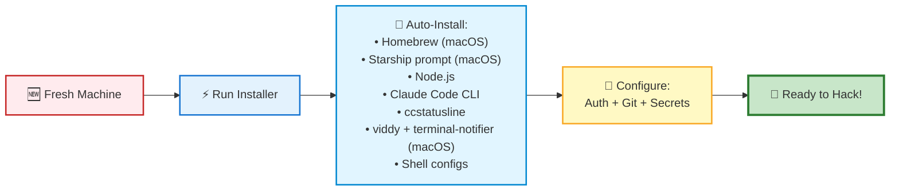

# Dotfiles for macOS & GitHub Codespaces

Automated shell configuration for consistent development environments across
platforms.


```mermaid
flowchart LR
    A["🆕 Fresh Machine"] --> B["⚡ Run Installer"]
    B --> C["🤖 Auto-Install:<br/>• Homebrew (macOS)<br/>• Starship prompt (macOS)<br/>• Node.js<br/>• Claude Code CLI<br/>• ccstatusline<br/>• viddy + terminal-notifier (macOS)<br/>• Shell configs"]
    C --> D["👤 Configure:<br/>Auth + Git + Secrets"]
    D --> E["🚀 Ready to Hack!"]

    style A fill:#ffebee,stroke:#c62828,stroke-width:2px
    style B fill:#e3f2fd,stroke:#1976d2,stroke-width:2px
    style C fill:#e1f5ff,stroke:#0288d1,stroke-width:2px
    style D fill:#fff9c4,stroke:#f9a825,stroke-width:2px
    style E fill:#c8e6c9,stroke:#2e7d32,stroke-width:3px
```

## Features by Platform

### macOS
- **zsh** with [Starship](https://starship.rs/) prompt
- Homebrew PATH management
- Scheduled jobs (e.g., screenshots archive) installed as user LaunchAgents
- Local notifications via `terminal-notifier` for Claude Code hooks
- Timestamped backups of existing configs

### GitHub Codespaces
- **bash** configuration optimized for cloud development
- Automatic installation via Codespaces settings
- Quick setup for ephemeral environments

### Both Platforms
- [Claude Code CLI](https://docs.claude.com/en/docs/claude-code/overview) — AI coding assistant
- [ccstatusline](https://github.com/sirmalloc/ccstatusline) — Claude Code status line
- Shared git config with GitHub no-reply email

## Quick Start

### macOS

```bash
git clone https://github.com/YOUR_USERNAME/dotfiles.git
cd dotfiles
./install-macos.sh
source ~/.zshrc
```

The installer will:
- Create timestamped backups of existing configs (`.zshrc.backup.YYYY-MM-DD_HHMMSS_nnn`)
- Install Homebrew (if not present)
- Install Starship prompt
- Install Node.js and CLI tools (Claude Code, ccstatusline, viddy, terminal-notifier)
- Copy shell configs and wire `source ~/.zshrc.dotfiles` into `~/.zshrc`
- Register scheduled jobs as user LaunchAgents (running directly from the repo)

### GitHub Codespaces (Linux)

1. Go to [Codespaces settings](https://github.com/settings/codespaces)
2. Enable "Automatically install dotfiles"
3. Select this repository

`install.sh` runs automatically on Codespace creation.

## Post-Installation Setup

### 1. Authenticate Claude Code

```bash
claude
```

Follow the interactive prompts.

### 2. Update Git Configuration

Edit `shared/.gitconfig` with your name and GitHub no-reply email
(https://github.com/settings/emails).

### 3. Configure API Keys (macOS)

Create a secrets file — already auto-sourced by `.zshrc.dotfiles` and ignored
by git:

```bash
cat > ~/.secrets.zsh << 'EOF'
export MY_API_KEY=""
export ANOTHER_SECRET=""
EOF
chmod 600 ~/.secrets.zsh
```

**For Codespaces:** use GitHub's built-in
[Codespaces secrets management](https://docs.github.com/en/codespaces/managing-your-codespaces/managing-secrets-for-your-codespaces)
instead.

### 4. Reload Shell

```bash
source ~/.zshrc   # macOS
source ~/.bashrc  # Codespaces
```

## Repository Structure

```
dotfiles/
├── install-macos.sh              # macOS installer
├── install.sh                    # Codespaces installer
├── README.md
│
├── .docs/                        # Architecture + design notes
│
├── shared/                       # Cross-platform configs
│   ├── .gitconfig
│   ├── starship.toml             # Starship prompt config
│   └── ccstatusline.settings.json
│
├── local-macos/                  # macOS-specific
│   ├── .zshrc.dotfiles           # zsh config, sourced by ~/.zshrc
│   ├── .aliases.dotfiles         # zsh aliases and functions
│   ├── .claude-settings.json     # Claude Code settings (terminal-notifier hooks)
│   ├── launchd/                  # Scheduled jobs (LaunchAgents + scripts)
│   │   ├── README.md
│   │   ├── screenshots-archive.sh
│   │   └── com.cengiz.screenshots-archive.plist.template
│   └── scripts/                  # Manual-run utilities
│       ├── set-zed-defaults.sh
│       ├── dev.sh
│       └── README.md
│
└── codespaces/                   # Codespaces-specific (bash)
    ├── .bashrc.dotfiles
    ├── .aliases.dotfiles
    └── .claude-settings.json
```

## Ongoing Customization

### PATH / Env vars

Edit `local-macos/.zshrc.dotfiles` or `codespaces/.bashrc.dotfiles`.

### Aliases and functions

Edit `local-macos/.aliases.dotfiles` or `codespaces/.aliases.dotfiles`.

### Secrets

Never commit secrets. Use `~/.secrets.zsh` (macOS) or Codespaces secrets.

### Starship prompt

`~/.config/starship.toml` is installed on first run from
`shared/starship.toml` and preserved on subsequent runs. To update everywhere,
edit `shared/starship.toml` and `cp` it over, or run `starship preset <name>`
interactively and commit the result.

### Auto-install additional tools

Edit `install-macos.sh` or `install.sh` and add the relevant `brew install` /
`npm install -g` lines.

## Scheduled Jobs (macOS)

User-level LaunchAgents live in `local-macos/launchd/`. The installer
registers each one via `launchctl bootstrap` and generates the plist from a
template so the job runs straight from the repo path (no `~/bin/` copy).

See `local-macos/launchd/README.md` for the current list of jobs and
operational commands (logs, kickstart, bootout, etc.).

## Backup & Restore

### Automatic Backups

Installers create timestamped backups:

```
~/.zshrc.backup.YYYY-MM-DD_HHMMSS_nnn
~/.aliases.backup.YYYY-MM-DD_HHMMSS_nnn
~/.gitconfig.backup.YYYY-MM-DD_HHMMSS_nnn
```

### Restore

```bash
cp ~/.zshrc.backup.YYYY-MM-DD_HHMMSS_nnn ~/.zshrc
cp ~/.aliases.backup.YYYY-MM-DD_HHMMSS_nnn ~/.aliases
cp ~/.gitconfig.backup.YYYY-MM-DD_HHMMSS_nnn ~/.gitconfig
source ~/.zshrc
```

## Troubleshooting

### Codespaces

**Dotfiles not applying:** Check
[settings](https://github.com/settings/codespaces) and logs at
`/workspaces/.codespaces/.persistedshare/creation.log`.

### macOS

**Starship prompt not showing:**

```bash
brew list starship           # confirm installed
brew install starship        # reinstall if missing
cat ~/.zshrc.dotfiles | grep starship  # confirm init line present
source ~/.zshrc
```

**Claude Code not found:**

```bash
npm list -g @anthropic-ai/claude-code
npm install -g @anthropic-ai/claude-code   # reinstall
```

## Security

### What's NOT in this repository
- ❌ API keys, tokens, or passwords
- ❌ SSH private keys
- ❌ Personal credentials

### What IS ignored by `.gitignore`
- ✅ `.secrets.zsh` and `.secrets.sh`
- ✅ Files matching `*_API_KEY*`, `*_SECRET*`, `*_TOKEN*`
- ✅ `.env` and `.env.*` files
- ✅ Backup files (`*.backup.*`)

### Best Practices
1. Use `~/.secrets.zsh` for API keys on macOS
2. Use Codespaces secrets management on Codespaces
3. Use `.env` for project-scoped secrets
4. Review `git diff` before committing

## Resources

- [ADR: Surgical Shell Installation](.docs/001-surgical-shell-installation.md)
- [GitHub Codespaces Docs](https://docs.github.com/en/codespaces)
- [Claude Code Docs](https://docs.claude.com/en/docs/claude-code/overview)
- [Starship Docs](https://starship.rs/config/)

## License

MIT License.
