# Dotfiles for GitHub Codespaces & macOS

Automated shell configuration for consistent development environments across platforms.

```mermaid
flowchart LR
    A["🆕 Fresh Machine"] --> B["⚡ Run Installer"]
    B --> C["🤖 Auto-Install:<br/>• Homebrew (macOS)<br/>• Powerlevel10k (macOS)<br/>• Node.js<br/>• 🤖 Claude Code CLI<br/>• 📱 Happy Coder<br/>• ccstatusline<br/>• viddy (macOS)<br/>• Shell configs"]
    C --> D["👤 Configure:<br/>Auth + Git + Notifications"]
    D --> E["🚀 Ready to Hack!"]

    style A fill:#ffebee,stroke:#c62828,stroke-width:2px
    style B fill:#e3f2fd,stroke:#1976d2,stroke-width:2px
    style C fill:#e1f5ff,stroke:#0288d1,stroke-width:2px
    style D fill:#fff9c4,stroke:#f9a825,stroke-width:2px
    style E fill:#c8e6c9,stroke:#2e7d32,stroke-width:3px
```



**One command + 5 minutes = AI-powered development with Claude Code, push notifications, and a beautiful terminal.**

## Features by Platform

### macOS
- **zsh** with [Powerlevel10k](https://github.com/romkatv/powerlevel10k) theme
- Your custom p10k configuration preserved
- Homebrew PATH management
- Timestamped backups of existing configs

### GitHub Codespaces
- **bash** configuration optimized for cloud development
- Automatic installation via Codespaces settings
- Quick setup for ephemeral environments

### Both Platforms
- [Claude Code CLI](https://docs.claude.com/en/docs/claude-code/overview) - AI coding assistant
- [Happy Coder](https://github.com/slopus/happy-cli) - Mobile Claude Code control and push notifications
- [ccstatusline](https://github.com/sirmalloc/ccstatusline) - Claude Code status line
- GitHub privacy protection (no-reply email)

## Quick Start

### GitHub Codespaces (Linux)

GitHub Codespaces automatically installs dotfiles:

1. Go to [Codespaces settings](https://github.com/settings/codespaces)
2. Enable "Automatically install dotfiles"
3. Select this repository

When you create a Codespace, `install.sh` runs automatically.

### macOS (Manual Installation)

Clone and run the installer:

```bash
git clone https://github.com/YOUR_USERNAME/dotfiles.git
cd dotfiles
./install-macos.sh
```

The installer will:
- ✅ Create timestamped backups of your existing configs (`.zshrc.backup.YYYY-MM-DD`)
- ✅ Install Homebrew (if not present)
- ✅ Install Powerlevel10k theme
- ✅ Install Node.js and CLI tools
- ✅ Create symlinks to dotfiles
- ✅ Apply the configuration

After installation:

```bash
source ~/.zshrc
```

## Post-Installation Setup

### 1. Authenticate Claude Code

```bash
claude
```

Follow the interactive prompts to authenticate with your Anthropic API key.

### 2. Update Git Configuration

Edit `shared/.gitconfig` and replace with your information:

```bash
[user]
    name = Your Name
    email = YOUR_ID+username@users.noreply.github.com
```

Get your GitHub no-reply email at: https://github.com/settings/emails

### 3. Configure API Keys (macOS only)

Create a secrets file for your API keys:

```bash
# Create ~/.secrets.zsh (already sourced by .zshrc.dotfiles)
cat > ~/.secrets.zsh << 'EOF'
# API Keys and Secrets
export MY_API_KEY="your-key-here"
export ANOTHER_SECRET="your-secret-here"
# Add other secrets as needed
EOF

chmod 600 ~/.secrets.zsh
```

This file is:
- ✅ Automatically sourced by `.zshrc.dotfiles`
- ✅ Ignored by git (in `.gitignore`)
- ✅ Private to your machine only

**For Codespaces:** Use GitHub's built-in [Codespaces secrets management](https://docs.github.com/en/codespaces/managing-your-codespaces/managing-secrets-for-your-codespaces) instead.

### 4. Configure Happy Server (for notifications)

**Option A: Use official Happy CLI**
- Remove `HAPPY_SERVER_URL` from your shell config
- Skip to step 5

**Option B: Use custom Happy deployment ([self-hosting guide](https://happy.engineering/docs/guides/self-hosting/))**
- Update `HAPPY_SERVER_URL` in:
  - **macOS:** `local-macos/.zshrc`
  - **Codespaces:** `codespaces/.bashrc`

### 5. Set Up Notifications (optional)

If using Happy notifications:

1. Follow [.docs/CLAUDE_NOTIFICATIONS_SETUP.md](.docs/CLAUDE_NOTIFICATIONS_SETUP.md)
2. Register with Happy server
3. Install Happy mobile app
4. Connect your device

### 6. Reload Shell

**macOS:**
```bash
source ~/.zshrc
```

**Codespaces:**
```bash
source ~/.bashrc
```

You're ready to go! Claude Code will now send push notifications when it needs input or completes tasks.

## Repository Structure

```
dotfiles/
├── .gitignore                # Ignores secrets and backups
├── install.sh                # Codespaces installer
├── install-macos.sh          # macOS installer
├── README.md                 # This file
│
├── .docs/                    # Documentation
│   ├── 001-surgical-shell-installation.md
│   └── CLAUDE_NOTIFICATIONS_SETUP.md
│
├── shared/                   # Shared configuration (both platforms)
│   ├── .gitconfig            # Git configuration
│   ├── .claude-settings.json # Claude Code settings
│   └── ccstatusline.settings.json # Status line config
│
├── local-macos/              # macOS-specific (zsh)
│   ├── .zshrc                # zsh configuration
│   ├── .p10k.zsh             # Powerlevel10k theme
│   └── .aliases              # macOS aliases
│
└── codespaces/               # Codespaces-specific (bash)
    ├── .bashrc               # bash configuration
    └── .aliases              # Codespaces aliases
```

## Ongoing Customization

### Add to PATH

**macOS:** Edit `local-macos/.zshrc`
```bash
export PATH="$HOME/my-tools:$PATH"
```

**Codespaces:** Edit `codespaces/.bashrc`
```bash
export PATH="$HOME/.local/bin:$PATH"
```

### Add Aliases

**macOS:** Edit `local-macos/.aliases`
```bash
alias gp='git push'
alias gs='git status'
```

**Codespaces:** Edit `codespaces/.aliases`
```bash
alias ll='ls -alh'
```

### Add Environment Variables

**macOS:** Edit `local-macos/.zshrc`
```bash
export MY_VAR="value"
```

**Codespaces:** Edit `codespaces/.bashrc`
```bash
export MY_VAR="value"
```

⚠️ **Never commit secrets!** Use `~/.secrets.zsh` (macOS) for API keys. For Codespaces, use GitHub's built-in secrets management. Use `.env` files for project-specific secrets.

### Add Functions

**macOS:** Edit `local-macos/.aliases`
```bash
function gcp() {
    git add -A && git commit -m "$1" && git push
}
```

**Codespaces:** Edit `codespaces/.aliases`
```bash
function gcp() {
    git add -A && git commit -m "$1" && git push
}
```

### Environment-Specific Config

**Codespaces detection:**
```bash
if [ "$CODESPACES" = "true" ]; then
    export CODESPACE_SPECIFIC="value"
fi
```

**macOS detection:**
```bash
if [ "$(uname)" = "Darwin" ]; then
    export MAC_SPECIFIC="value"
fi
```

**Use cases:**
- Different API endpoints for development vs production
- Platform-specific tool paths
- Environment-specific debug settings

### Auto-Install Additional Tools

**macOS:** Edit `install-macos.sh`
```bash
brew install gh
npm install -g typescript
```

**Codespaces:** Edit `install.sh`
```bash
sudo apt-get install -y neovim
npm install -g typescript
```

## Powerlevel10k Configuration (macOS)

The included `.p10k.zsh` uses a lean prompt style. To customize:

```bash
p10k configure
```

This will run the interactive configuration wizard.

## What's Included

**Shell Configuration:**
- **macOS:** zsh with Powerlevel10k theme
- **Codespaces:** bash with custom prompt
- Git aliases (`co`, `br`, `pr`, `st`, `ld`, `ll`, etc.)
- Custom aliases and functions

**Auto-Installed Tools:**
- [Homebrew](https://brew.sh/) (macOS only)
- [Powerlevel10k](https://github.com/romkatv/powerlevel10k) (macOS only)
- [Node.js](https://nodejs.org/)
- [Claude Code CLI](https://docs.claude.com/en/docs/claude-code/overview)
- [Happy Coder](https://github.com/slopus/happy-cli)
- [ccstatusline](https://github.com/sirmalloc/ccstatusline)
- [viddy](https://github.com/sachaos/viddy) (macOS only) - Modern watch command replacement

**Features:**
- Push notifications when Claude Code needs input
- GitHub privacy protection (no-reply email)
- Separate configurations for each platform
- Timestamped backups (won't overwrite previous backups)
- API key management via `.secrets.zsh` (macOS)

## Backup & Restore

### Automatic Backups

When you run `install-macos.sh`, it creates timestamped backups:

```
~/.zshrc.backup.2025-10-15
~/.p10k.zsh.backup.2025-10-15
~/.aliases.backup.2025-10-15
~/.gitconfig.backup.2025-10-15
```

### Restore from Backup

```bash
# Remove symlinks
rm ~/.zshrc ~/.p10k.zsh ~/.aliases ~/.gitconfig

# Restore from backup
cp ~/.zshrc.backup.YYYY-MM-DD ~/.zshrc
cp ~/.p10k.zsh.backup.YYYY-MM-DD ~/.p10k.zsh
cp ~/.aliases.backup.YYYY-MM-DD ~/.aliases
cp ~/.gitconfig.backup.YYYY-MM-DD ~/.gitconfig

# Reload shell
source ~/.zshrc
```

## Troubleshooting

### Codespaces

**Dotfiles not applying:**
Check [settings](https://github.com/settings/codespaces) and logs at `/workspaces/.codespaces/.persistedshare/creation.log`

**Claude Code not found:**
```bash
npm list -g @anthropic-ai/claude-code
npm install -g @anthropic-ai/claude-code  # reinstall
```

### macOS

**Powerlevel10k not loading:**
```bash
# Check if Powerlevel10k is installed
brew list powerlevel10k

# Reinstall if needed
brew install powerlevel10k

# Reload shell
source ~/.zshrc
```

**Symlinks not working:**
```bash
# Check symlinks
ls -la ~/ | grep "\->"

# Expected output:
# .zshrc -> /path/to/dotfiles/local-macos/.zshrc
# .p10k.zsh -> /path/to/dotfiles/local-macos/.p10k.zsh
# .aliases -> /path/to/dotfiles/local-macos/.aliases
# .gitconfig -> /path/to/dotfiles/shared/.gitconfig
```

**Authentication:**
Run `claude` and follow prompts.

## Security

### What's NOT in this repository:
- ❌ API keys or secrets
- ❌ Personal authentication tokens
- ❌ SSH private keys
- ❌ Any credentials

### What IS ignored by git:
- ✅ `.secrets.zsh` and `.secrets.sh`
- ✅ Files matching `*_API_KEY*`, `*_SECRET*`, `*_TOKEN*`
- ✅ `.env` and `.env.*` files
- ✅ Backup files (`*.backup.*`)
- ✅ Local configuration files

### Best Practices:
1. Use `~/.secrets.zsh` for API keys on macOS
2. Use GitHub's built-in secrets management for Codespaces
3. Use `.env` files for project-specific secrets
4. Never commit files with credentials
5. Review changes before committing: `git diff`

## Resources

- [ADR: Surgical Shell Installation](.docs/001-surgical-shell-installation.md)
- [Claude Notifications Setup](.docs/CLAUDE_NOTIFICATIONS_SETUP.md)
- [GitHub Codespaces Docs](https://docs.github.com/en/codespaces)
- [Claude Code Docs](https://docs.claude.com/en/docs/claude-code/overview)
- [Powerlevel10k Docs](https://github.com/romkatv/powerlevel10k)
- [Dotfiles Guide](https://dotfiles.github.io/)

## Contributing

Found a bug or have a suggestion? Open an issue or submit a pull request!

## License

MIT License - Feel free to use and modify for your own dotfiles.
